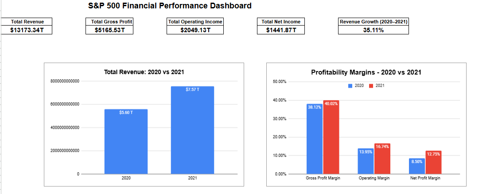
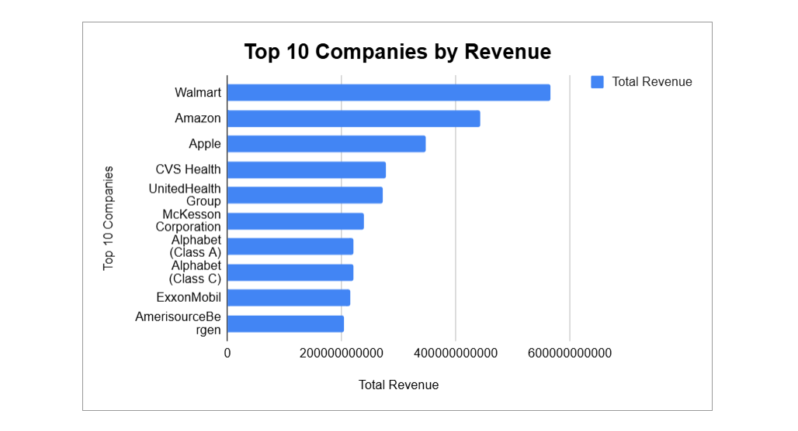

# S&P 500 Corporate Financial Analysis

A financial analysis project using **Google Sheets** to analyze the financial performance of S&P 500 companies, focusing on revenue, profitability, operating performance, and year-over-year growth.

## 📊 Project Overview

This project analyzes financial data of S&P 500 companies for 2020 and 2021. The analysis includes data auditing, financial calculations, company-level comparisons, pivot tables, and a KPI dashboard.

The objective was to transform financial data into meaningful business insights using spreadsheet-based analysis.

## 🛠️ Tools Used

* Google Sheets
* Pivot Tables
* Spreadsheet Formulas
* Data Cleaning
* Data Visualization

## 🔍 Analysis Performed

* Data cleaning and quality auditing
* Missing-value and duplicate checks
* Revenue and profitability analysis
* Gross profit, operating income, and net income analysis
* Year-over-year growth analysis
* Profitability margin analysis
* Cost structure analysis
* Company-level financial comparisons
* Top 10 companies by revenue, operating income, and net income
* Pivot table analysis
* KPI dashboard development

## 📈 Key Insights

* Revenue increased by **35.11%** from 2020 to 2021.
* Operating income grew by **62.07%**, showing improved operating profitability.
* Net income increased by **102.63%**, indicating a significant improvement in overall profitability.
* Gross profit margin improved from **38.12% to 40.02%**.
* Operating margin increased from **13.95% to 16.74%**.
* Net profit margin improved from **8.50% to 12.75%**.

## 📊 Dashboard

### Dashboard Overview

### Top 10 Companies by Revenue

## 📁 Project Files

* `S&P_500_Financial_Analysis.xlsx` — Complete analysis workbook created in Google Sheets and exported as an Excel file
* `dashboard_overview.png` — Dashboard overview
* `top_10_companies_revenue.png` — Top 10 companies by revenue visualization

## 🎯 Skills Demonstrated

* Financial Data Analysis
* Data Cleaning
* Spreadsheet Analysis
* Financial Metrics & Ratios
* Pivot Tables
* Data Visualization
* Dashboard Development
* Business Insights

## 📌 Dataset

The financial dataset used for this project was obtained from Kaggle. The analysis and dashboard were developed using Google Sheets.
